# [📈 Live Status](https://center-for-applied-ocean-technology.github.io/smartatlantic-monitor): <!--live status--> **🟧 Partial outage**

This repository contains the open-source uptime monitor and status page for [center-for-applied-ocean-technology](https://center-for-applied-ocean-technology.github.io/smartatlantic-monitor), powered by [Upptime](https://github.com/upptime/upptime).

With [Upptime](https://upptime.js.org), you can get your own unlimited and free uptime monitor and status page, powered entirely by a GitHub repository. We use [Issues](https://github.com/center-for-applied-ocean-technology/smartatlantic-monitor/issues) as incident reports, [Actions](https://github.com/center-for-applied-ocean-technology/smartatlantic-monitor/actions) as uptime monitors, and [Pages](https://center-for-applied-ocean-technology.github.io/smartatlantic-monitor) for the status page.

<!--start: status pages-->
<!-- This summary is generated by Upptime (https://github.com/upptime/upptime) -->
<!-- Do not edit this manually, your changes will be overwritten -->
<!-- prettier-ignore -->
| URL | Status | History | Response Time | Uptime |
| --- | ------ | ------- | ------------- | ------ |
|  [SmartAtlantic](https://www.smartatlantic.ca) | 🟩 Up | [smart-atlantic.yml](https://github.com/center-for-applied-ocean-technology/smartatlantic-monitor/commits/HEAD/history/smart-atlantic.yml) | 

 488ms
     
 | 

<a href="https://center-for-applied-ocean-technology.github.io/smartatlantic-monitor/history/smart-atlantic">100.00%</a>
    

|  [SmartAtlantic ERDDAP](https://www.smartatlantic.ca/erddap/index.html) | 🟩 Up | [smart-atlantic-erddap.yml](https://github.com/center-for-applied-ocean-technology/smartatlantic-monitor/commits/HEAD/history/smart-atlantic-erddap.yml) | 

 197ms
     
 | 

<a href="https://center-for-applied-ocean-technology.github.io/smartatlantic-monitor/history/smart-atlantic-erddap">100.00%</a>
    

|  [Channel-Port Aux Basques Buoy](https://www.smartatlantic.ca/erddap/tabledap/SMA_port_aux_basques.json?time&time>=now-240minutes&distinct()) | 🟩 Up | [channel-port-aux-basques-buoy.yml](https://github.com/center-for-applied-ocean-technology/smartatlantic-monitor/commits/HEAD/history/channel-port-aux-basques-buoy.yml) | 

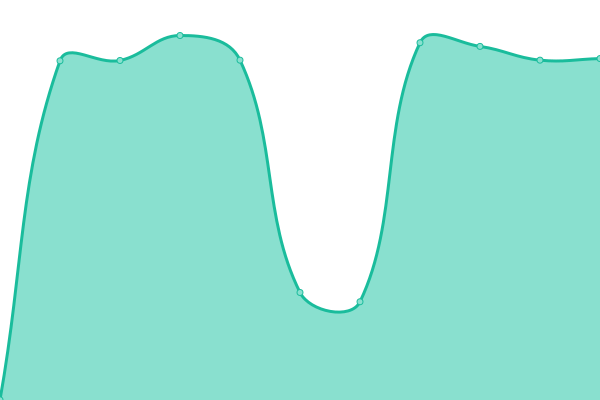 714ms
     
 | 

<a href="https://center-for-applied-ocean-technology.github.io/smartatlantic-monitor/history/channel-port-aux-basques-buoy">100.00%</a>
    

|  [Channel-Port Aux Basques Tide Station](https://www.smartatlantic.ca/erddap/tabledap/SMA_port_aux_basqes_wharf.json?time&time>=now-20minutes&distinct()) | 🟩 Up | [channel-port-aux-basques-tide-station.yml](https://github.com/center-for-applied-ocean-technology/smartatlantic-monitor/commits/HEAD/history/channel-port-aux-basques-tide-station.yml) | 

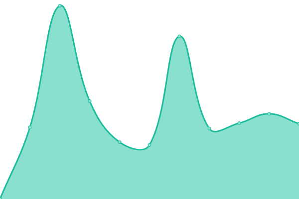 3294ms
     
 | 

<a href="https://center-for-applied-ocean-technology.github.io/smartatlantic-monitor/history/channel-port-aux-basques-tide-station">100.00%</a>
    

|  [COVE Weather Station, IDARTM1](https://www.smartatlantic.ca/erddap/tabledap/cove_weather_station_idartm1.json?time&time>=now-30min&distinct()) | 🟩 Up | [cove-weather-station-idartm-1.yml](https://github.com/center-for-applied-ocean-technology/smartatlantic-monitor/commits/HEAD/history/cove-weather-station-idartm-1.yml) | 

 439ms
     
 | 

<a href="https://center-for-applied-ocean-technology.github.io/smartatlantic-monitor/history/cove-weather-station-idartm-1">100.00%</a>
    

|  [Diamond Jubilee Cruise Ship Terminal Meteorological Station](https://www.smartatlantic.ca/erddap/tabledap/SMA_saint_john_cruise_terminal.json?time&time>=now-20minutes&distinct()) | 🟥 Down | [diamond-jubilee-cruise-ship-terminal-meteorological-station.yml](https://github.com/center-for-applied-ocean-technology/smartatlantic-monitor/commits/HEAD/history/diamond-jubilee-cruise-ship-terminal-meteorological-station.yml) | 

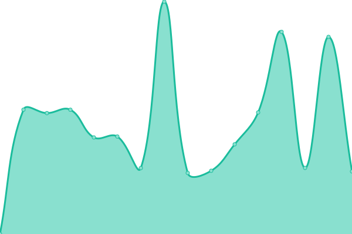 2081ms
     
 | 

<a href="https://center-for-applied-ocean-technology.github.io/smartatlantic-monitor/history/diamond-jubilee-cruise-ship-terminal-meteorological-station">100.00%</a>
    

|  [ECCC OPP, 44488, East Chedabucto Bay](https://www.smartatlantic.ca/erddap/tabledap/eccc_opp_44488_east_chedabucto_bay.json?time&time>=now-20minutes&distinct()) | 🟩 Up | [eccc-opp-44488-east-chedabucto-bay.yml](https://github.com/center-for-applied-ocean-technology/smartatlantic-monitor/commits/HEAD/history/eccc-opp-44488-east-chedabucto-bay.yml) | 

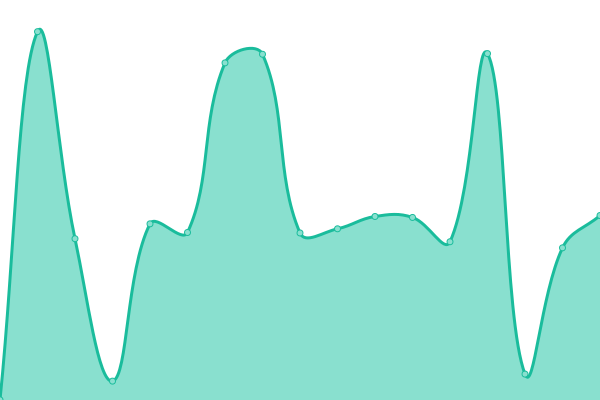 1437ms
     
 | 

<a href="https://center-for-applied-ocean-technology.github.io/smartatlantic-monitor/history/eccc-opp-44488-east-chedabucto-bay">95.20%</a>
    

|  [ECCC OPP, 44489, West Chedabucto Bay](https://www.smartatlantic.ca/erddap/tabledap/eccc_opp_44489_west_chedabucto_bay.json?time&time>=now-20minutes&distinct()) | 🟩 Up | [eccc-opp-44489-west-chedabucto-bay.yml](https://github.com/center-for-applied-ocean-technology/smartatlantic-monitor/commits/HEAD/history/eccc-opp-44489-west-chedabucto-bay.yml) | 

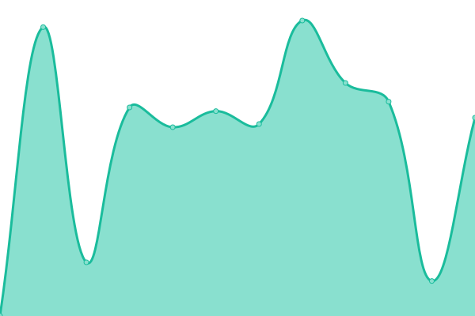 629ms
     
 | 

<a href="https://center-for-applied-ocean-technology.github.io/smartatlantic-monitor/history/eccc-opp-44489-west-chedabucto-bay">100.00%</a>
    

|  [ECCC OPP, 44490, West Bay of Fundy](https://www.smartatlantic.ca/erddap/tabledap/eccc_opp_44490_west_bay_of_fundy.json?time&time>=now-20minutes&distinct()) | 🟥 Down | [eccc-opp-44490-west-bay-of-fundy.yml](https://github.com/center-for-applied-ocean-technology/smartatlantic-monitor/commits/HEAD/history/eccc-opp-44490-west-bay-of-fundy.yml) | 

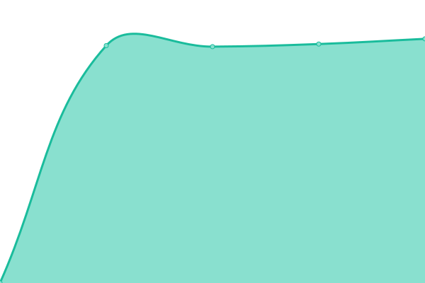 2113ms
     
 | 

<a href="https://center-for-applied-ocean-technology.github.io/smartatlantic-monitor/history/eccc-opp-44490-west-bay-of-fundy">0.01%</a>
    

|  [Fortune Bay Buoy](https://www.smartatlantic.ca/erddap/tabledap/SMA_Fortune_Bay_Buoy.json?time&time>=now-120minutes&distinct()) | 🟥 Down | [fortune-bay-buoy.yml](https://github.com/center-for-applied-ocean-technology/smartatlantic-monitor/commits/HEAD/history/fortune-bay-buoy.yml) | 

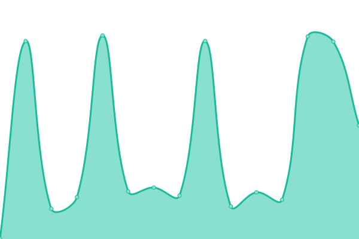 1363ms
     
 | 

<a href="https://center-for-applied-ocean-technology.github.io/smartatlantic-monitor/history/fortune-bay-buoy">89.39%</a>
    

|  [Fortune Bay: Dog Island - DOGIS](https://www.smartatlantic.ca/erddap/tabledap/DFO_Sutron_DOGIS.json?time&time>=now-2hours&distinct()) | 🟩 Up | [fortune-bay-dog-island-dogis.yml](https://github.com/center-for-applied-ocean-technology/smartatlantic-monitor/commits/HEAD/history/fortune-bay-dog-island-dogis.yml) | 

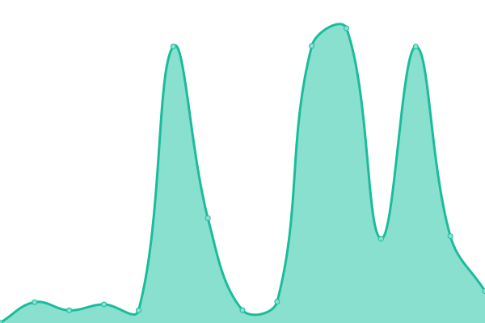 1705ms
     
 | 

<a href="https://center-for-applied-ocean-technology.github.io/smartatlantic-monitor/history/fortune-bay-dog-island-dogis">39.23%</a>
    

|  [Fortune Bay: Pool's Cove - POOLC](https://www.smartatlantic.ca/erddap/tabledap/DFO_Sutron_POOLC.json?time&time>=now-2hours&distinct()) | 🟩 Up | [fortune-bay-pool-s-cove-poolc.yml](https://github.com/center-for-applied-ocean-technology/smartatlantic-monitor/commits/HEAD/history/fortune-bay-pool-s-cove-poolc.yml) | 

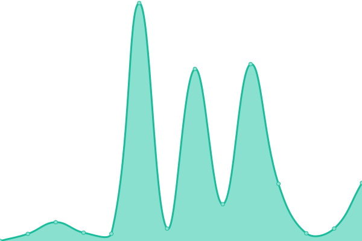 1825ms
     
 | 

<a href="https://center-for-applied-ocean-technology.github.io/smartatlantic-monitor/history/fortune-bay-pool-s-cove-poolc">47.93%</a>
    

|  [Halifax (Herring Cove) Buoy](https://www.smartatlantic.ca/erddap/tabledap/SMA_halifax.json?time&time>=now-60minutes&distinct()) | 🟩 Up | [halifax-herring-cove-buoy.yml](https://github.com/center-for-applied-ocean-technology/smartatlantic-monitor/commits/HEAD/history/halifax-herring-cove-buoy.yml) | 

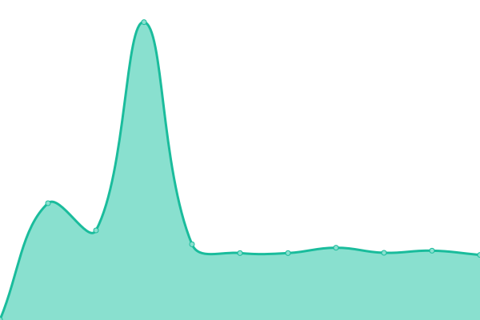 256ms
     
 | 

<a href="https://center-for-applied-ocean-technology.github.io/smartatlantic-monitor/history/halifax-herring-cove-buoy">100.00%</a>
    

|  [Halifax Ocean Terminals: Fairview](https://www.smartatlantic.ca/erddap/tabledap/SMA_halifax_fairview.json?time&time>=now-20minutes&distinct()) | 🟥 Down | [halifax-ocean-terminals-fairview.yml](https://github.com/center-for-applied-ocean-technology/smartatlantic-monitor/commits/HEAD/history/halifax-ocean-terminals-fairview.yml) | 

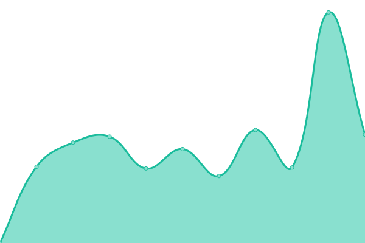 2542ms
     
 | 

<a href="https://center-for-applied-ocean-technology.github.io/smartatlantic-monitor/history/halifax-ocean-terminals-fairview">99.84%</a>
    

|  [Halifax Ocean Terminals: Pier 31](https://www.smartatlantic.ca/erddap/tabledap/SMA_halifax_anemometer1.json?time&time>=now-20minutes&distinct()) | 🟥 Down | [halifax-ocean-terminals-pier-31.yml](https://github.com/center-for-applied-ocean-technology/smartatlantic-monitor/commits/HEAD/history/halifax-ocean-terminals-pier-31.yml) | 

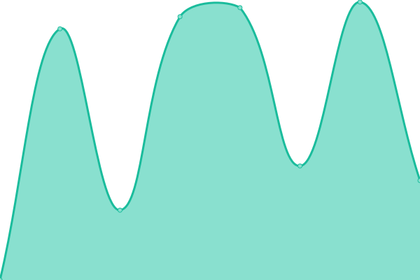 2430ms
     
 | 

<a href="https://center-for-applied-ocean-technology.github.io/smartatlantic-monitor/history/halifax-ocean-terminals-pier-31">99.86%</a>
    

|  [Halifax Ocean Terminals: Pier 9C](https://www.smartatlantic.ca/erddap/tabledap/SMA_halifax_pier9c.json?time&time>=now-20minutes&distinct()) | 🟥 Down | [halifax-ocean-terminals-pier-9-c.yml](https://github.com/center-for-applied-ocean-technology/smartatlantic-monitor/commits/HEAD/history/halifax-ocean-terminals-pier-9-c.yml) | 

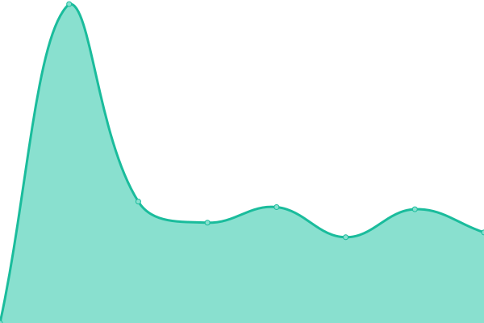 2200ms
     
 | 

<a href="https://center-for-applied-ocean-technology.github.io/smartatlantic-monitor/history/halifax-ocean-terminals-pier-9-c">99.88%</a>
    

|  [Holyrood Buoy 1, Raw Wind Data](https://www.smartatlantic.ca/erddap/tabledap/SMA_Holyrood_Buoy1_wind_raw.json?time&time>=now-10min&distinct()) | 🟥 Down | [holyrood-buoy-1-raw-wind-data.yml](https://github.com/center-for-applied-ocean-technology/smartatlantic-monitor/commits/HEAD/history/holyrood-buoy-1-raw-wind-data.yml) | 

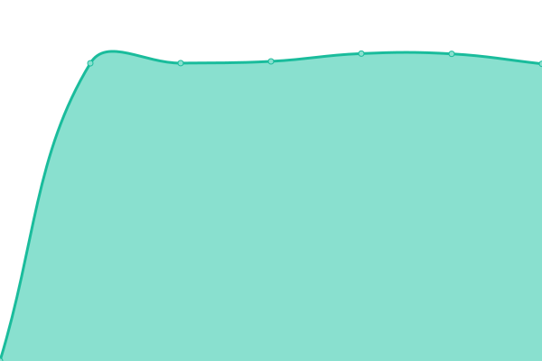 2082ms
     
 | 

<a href="https://center-for-applied-ocean-technology.github.io/smartatlantic-monitor/history/holyrood-buoy-1-raw-wind-data">0.01%</a>
    

|  [Holyrood Buoy 2](https://www.smartatlantic.ca/erddap/tabledap/SMA_Holyrood_Buoy2.json?time&time>=now-120minutes&distinct()) | 🟥 Down | [holyrood-buoy-2.yml](https://github.com/center-for-applied-ocean-technology/smartatlantic-monitor/commits/HEAD/history/holyrood-buoy-2.yml) | 

 2081ms
     
 | 

<a href="https://center-for-applied-ocean-technology.github.io/smartatlantic-monitor/history/holyrood-buoy-2">0.01%</a>
    

|  [Holyrood Shore Station, Test](https://www.smartatlantic.ca/erddap/tabledap/SMA_holyrood_shore_station.json?time&time>=now-10min&distinct()) | 🟥 Down | [holyrood-shore-station-test.yml](https://github.com/center-for-applied-ocean-technology/smartatlantic-monitor/commits/HEAD/history/holyrood-shore-station-test.yml) | 

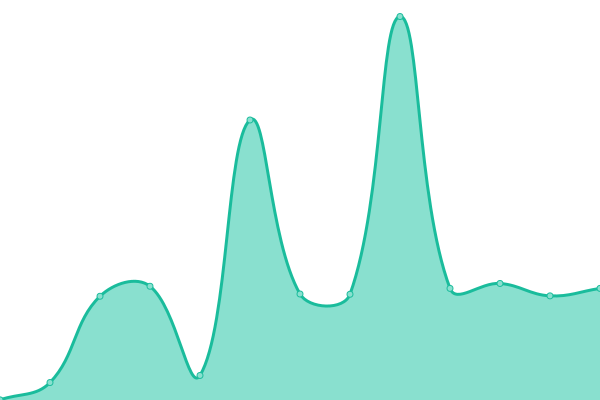 2081ms
     
 | 

<a href="https://center-for-applied-ocean-technology.github.io/smartatlantic-monitor/history/holyrood-shore-station-test">0.01%</a>
    

|  [Holyrood Wharf Weather Station](https://www.smartatlantic.ca/erddap/tabledap/SMA_holyrood_wharf.json?time&time>=now-44minutes&distinct()) | 🟥 Down | [holyrood-wharf-weather-station.yml](https://github.com/center-for-applied-ocean-technology/smartatlantic-monitor/commits/HEAD/history/holyrood-wharf-weather-station.yml) | 

 2081ms
     
 | 

<a href="https://center-for-applied-ocean-technology.github.io/smartatlantic-monitor/history/holyrood-wharf-weather-station">0.01%</a>
    

|  [Mouth of Placentia Bay Buoy](https://www.smartatlantic.ca/erddap/tabledap/SMA_MouthofPlacentiaBayBuoy.json?time&time>=now-60minutes&distinct()) | 🟥 Down | [mouth-of-placentia-bay-buoy.yml](https://github.com/center-for-applied-ocean-technology/smartatlantic-monitor/commits/HEAD/history/mouth-of-placentia-bay-buoy.yml) | 

 2087ms
     
 | 

<a href="https://center-for-applied-ocean-technology.github.io/smartatlantic-monitor/history/mouth-of-placentia-bay-buoy">0.01%</a>
    

|  [MSC Datamart realtime moored buoy data](https://www.smartatlantic.ca/erddap/tabledap/eccc_opp_atlantic.json?time&time>=now-20minutes&distinct()) | 🟩 Up | [msc-datamart-realtime-moored-buoy-data.yml](https://github.com/center-for-applied-ocean-technology/smartatlantic-monitor/commits/HEAD/history/msc-datamart-realtime-moored-buoy-data.yml) | 

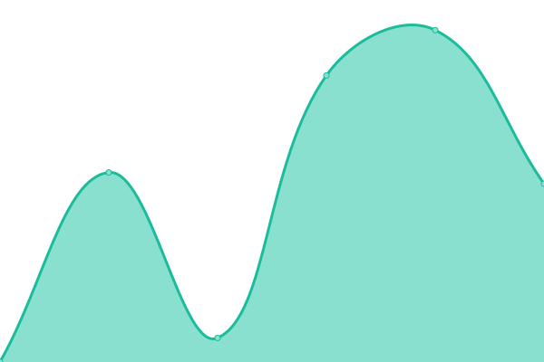 1437ms
     
 | 

<a href="https://center-for-applied-ocean-technology.github.io/smartatlantic-monitor/history/msc-datamart-realtime-moored-buoy-data">100.00%</a>
    

|  [NEGL, Black Tickle-Domino, NunatuKavut (NLQU0003)](https://www.smartatlantic.ca/erddap/tabledap/sma_negl_black_tickle_nlqu0003.json?time&time>=now-2hours&distinct()) | 🟩 Up | [negl-black-tickle-domino-nunatu-kavut-nlqu-0003.yml](https://github.com/center-for-applied-ocean-technology/smartatlantic-monitor/commits/HEAD/history/negl-black-tickle-domino-nunatu-kavut-nlqu-0003.yml) | 

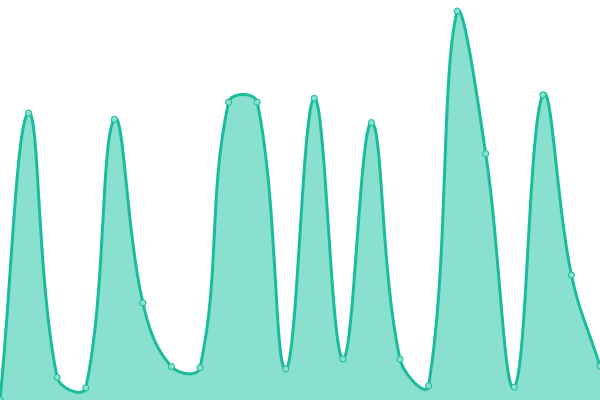 287ms
     
 | 

<a href="https://center-for-applied-ocean-technology.github.io/smartatlantic-monitor/history/negl-black-tickle-domino-nunatu-kavut-nlqu-0003">100.00%</a>
    

|  [NEGL, Cartwright Junction, Labrador (NLQU0004)](https://www.smartatlantic.ca/erddap/tabledap/sma_negl_cartwright_junction_nlqu0004.json?time&time>=now-2hours&distinct()) | 🟩 Up | [negl-cartwright-junction-labrador-nlqu-0004.yml](https://github.com/center-for-applied-ocean-technology/smartatlantic-monitor/commits/HEAD/history/negl-cartwright-junction-labrador-nlqu-0004.yml) | 

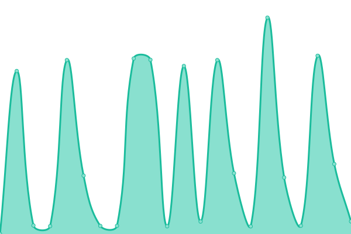 328ms
     
 | 

<a href="https://center-for-applied-ocean-technology.github.io/smartatlantic-monitor/history/negl-cartwright-junction-labrador-nlqu-0004">100.00%</a>
    

|  [NEGL, North West River, Labrador (NLQU0007)](https://www.smartatlantic.ca/erddap/tabledap/sma_negl_north_west_river_nlqu0007.json?time&time>=now-2hours&distinct()) | 🟩 Up | [negl-north-west-river-labrador-nlqu-0007.yml](https://github.com/center-for-applied-ocean-technology/smartatlantic-monitor/commits/HEAD/history/negl-north-west-river-labrador-nlqu-0007.yml) | 

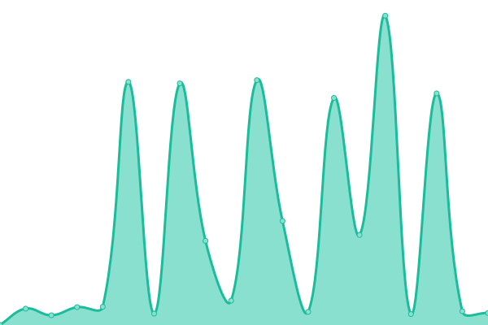 283ms
     
 | 

<a href="https://center-for-applied-ocean-technology.github.io/smartatlantic-monitor/history/negl-north-west-river-labrador-nlqu-0007">100.00%</a>
    

|  [NEGL, Postville, Nunatsiavut (NLQU0001)](https://www.smartatlantic.ca/erddap/tabledap/sma_negl_postville_nlqu0001.json?time&time>=now-2hours&distinct()) | 🟩 Up | [negl-postville-nunatsiavut-nlqu-0001.yml](https://github.com/center-for-applied-ocean-technology/smartatlantic-monitor/commits/HEAD/history/negl-postville-nunatsiavut-nlqu-0001.yml) | 

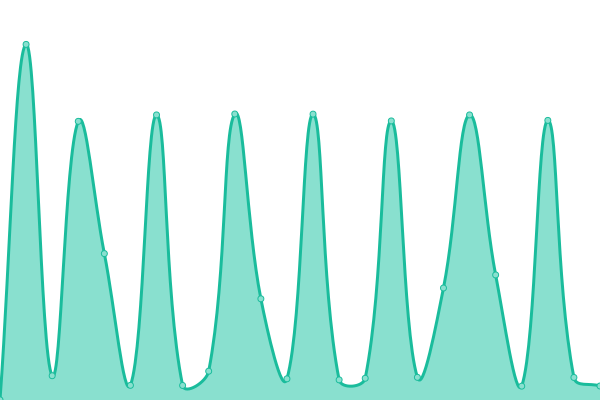 287ms
     
 | 

<a href="https://center-for-applied-ocean-technology.github.io/smartatlantic-monitor/history/negl-postville-nunatsiavut-nlqu-0001">100.00%</a>
    

|  [NEGL, Red Bay, NunatuKavut (NLQU0005)](https://www.smartatlantic.ca/erddap/tabledap/sma_negl_red_bay_nlqu0005.json?time&time>=now-2hours&distinct()) | 🟩 Up | [negl-red-bay-nunatu-kavut-nlqu-0005.yml](https://github.com/center-for-applied-ocean-technology/smartatlantic-monitor/commits/HEAD/history/negl-red-bay-nunatu-kavut-nlqu-0005.yml) | 

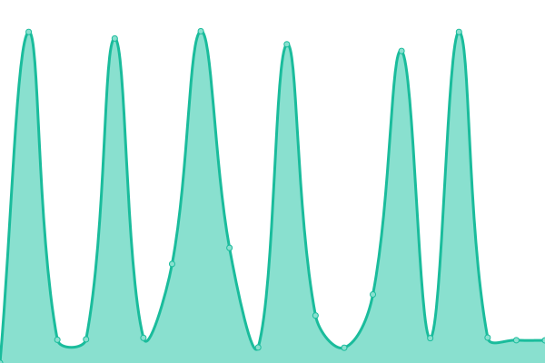 324ms
     
 | 

<a href="https://center-for-applied-ocean-technology.github.io/smartatlantic-monitor/history/negl-red-bay-nunatu-kavut-nlqu-0005">100.00%</a>
    

|  [NEGL, Rigolet, Nunatsiavut (NLQU0002)](https://www.smartatlantic.ca/erddap/tabledap/sma_negl_rigolet_nlqu0002.json?time&time>=now-2hours&distinct()) | 🟩 Up | [negl-rigolet-nunatsiavut-nlqu-0002.yml](https://github.com/center-for-applied-ocean-technology/smartatlantic-monitor/commits/HEAD/history/negl-rigolet-nunatsiavut-nlqu-0002.yml) | 

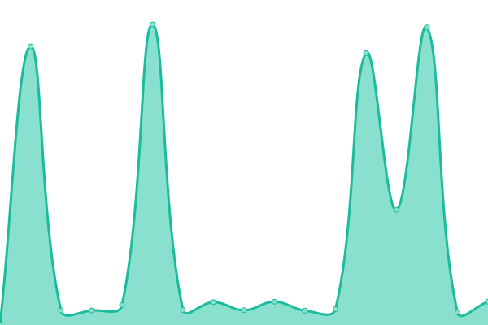 278ms
     
 | 

<a href="https://center-for-applied-ocean-technology.github.io/smartatlantic-monitor/history/negl-rigolet-nunatsiavut-nlqu-0002">100.00%</a>
    

|  [Pilot Boarding Station / Red Island Shoal Buoy](https://www.smartatlantic.ca/erddap/tabledap/SMA_red_island_shoal.json?time&time>=now-8hours&distinct()) | 🟥 Down | [pilot-boarding-station-red-island-shoal-buoy.yml](https://github.com/center-for-applied-ocean-technology/smartatlantic-monitor/commits/HEAD/history/pilot-boarding-station-red-island-shoal-buoy.yml) | 

 2082ms
     
 | 

<a href="https://center-for-applied-ocean-technology.github.io/smartatlantic-monitor/history/pilot-boarding-station-red-island-shoal-buoy">0.01%</a>
    

|  [Placentia Bay: North Harbour - NHARB](https://www.smartatlantic.ca/erddap/tabledap/DFO_Sutron_NHARB.json?time&time>=now-2hours&distinct()) | 🟥 Down | [placentia-bay-north-harbour-nharb.yml](https://github.com/center-for-applied-ocean-technology/smartatlantic-monitor/commits/HEAD/history/placentia-bay-north-harbour-nharb.yml) | 

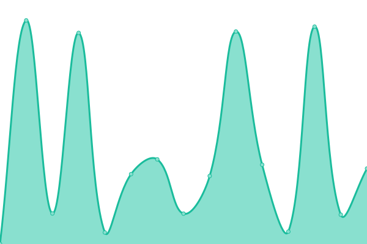 2080ms
     
 | 

<a href="https://center-for-applied-ocean-technology.github.io/smartatlantic-monitor/history/placentia-bay-north-harbour-nharb">0.01%</a>
    

|  [Placentia Bay: Ragged Islands - KLUMI](https://www.smartatlantic.ca/erddap/tabledap/DFO_Sutron_KLUMI.json?time&time>=now-2hours&distinct()) | 🟩 Up | [placentia-bay-ragged-islands-klumi.yml](https://github.com/center-for-applied-ocean-technology/smartatlantic-monitor/commits/HEAD/history/placentia-bay-ragged-islands-klumi.yml) | 

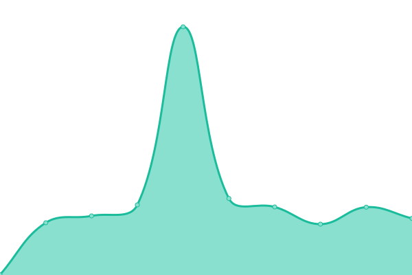 1797ms
     
 | 

<a href="https://center-for-applied-ocean-technology.github.io/smartatlantic-monitor/history/placentia-bay-ragged-islands-klumi">49.14%</a>
    

|  [Saint John Buoy](https://www.smartatlantic.ca/erddap/tabledap/SMA_saint_john.json?time&time>=now-60minutes&distinct()) | 🟩 Up | [saint-john-buoy.yml](https://github.com/center-for-applied-ocean-technology/smartatlantic-monitor/commits/HEAD/history/saint-john-buoy.yml) | 

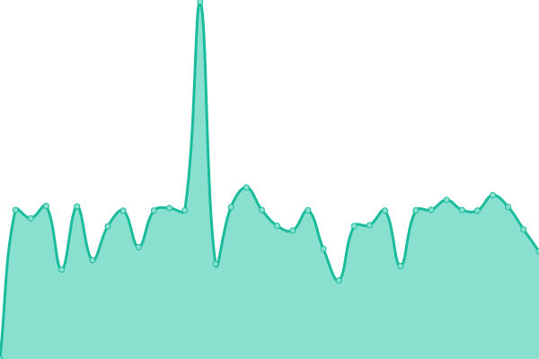 1981ms
     
 | 

<a href="https://center-for-applied-ocean-technology.github.io/smartatlantic-monitor/history/saint-john-buoy">100.00%</a>
    

|  [Shipissipan, Remote Automatic Weather Station (RAWS), Nitassinan](https://www.smartatlantic.ca/erddap/tabledap/parks_canada_shipissipan.json?time&time>=now-2hour&distinct()) | 🟩 Up | [shipissipan-remote-automatic-weather-station-raws-nitassinan.yml](https://github.com/center-for-applied-ocean-technology/smartatlantic-monitor/commits/HEAD/history/shipissipan-remote-automatic-weather-station-raws-nitassinan.yml) | 

 1812ms
     
 | 

<a href="https://center-for-applied-ocean-technology.github.io/smartatlantic-monitor/history/shipissipan-remote-automatic-weather-station-raws-nitassinan">100.00%</a>
    

|  [St. John's Buoy](https://www.smartatlantic.ca/erddap/tabledap/SMA_st_johns.json?time&time>=now-120minutes&distinct()) | 🟥 Down | [st-john-s-buoy.yml](https://github.com/center-for-applied-ocean-technology/smartatlantic-monitor/commits/HEAD/history/st-john-s-buoy.yml) | 

 2082ms
     
 | 

<a href="https://center-for-applied-ocean-technology.github.io/smartatlantic-monitor/history/st-john-s-buoy">0.01%</a>
    

|  [XEOS H1 Buoy Wave Sensor](https://www.smartatlantic.ca/erddap/tabledap/SmartAtlantic_XEOS_h1_buoy.json?time&time>=now-120minutes&distinct()) | 🟩 Up | [xeos-h1-buoy-wave-sensor.yml](https://github.com/center-for-applied-ocean-technology/smartatlantic-monitor/commits/HEAD/history/xeos-h1-buoy-wave-sensor.yml) | 

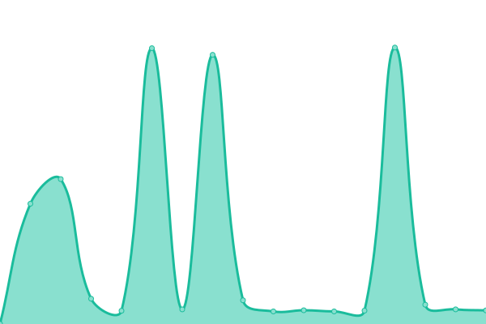 274ms
     
 | 

<a href="https://center-for-applied-ocean-technology.github.io/smartatlantic-monitor/history/xeos-h1-buoy-wave-sensor">100.00%</a>
    

|  [XEOS HKB Buoy Wave Sensor](https://www.smartatlantic.ca/erddap/tabledap/SmartAtlantic_XEOS_hkb_buoy.json?time&time>=now-120minutes&distinct()) | 🟩 Up | [xeos-hkb-buoy-wave-sensor.yml](https://github.com/center-for-applied-ocean-technology/smartatlantic-monitor/commits/HEAD/history/xeos-hkb-buoy-wave-sensor.yml) | 

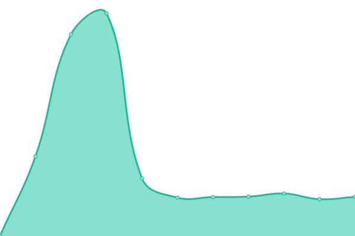 381ms
     
 | 

<a href="https://center-for-applied-ocean-technology.github.io/smartatlantic-monitor/history/xeos-hkb-buoy-wave-sensor">100.00%</a>
    

<!--end: status pages-->

[**Visit our status website →**](https://center-for-applied-ocean-technology.github.io/smartatlantic-monitor)

## 📄 License

- Powered by: [Upptime](https://github.com/upptime/upptime)
- Code: [MIT](./LICENSE) © [center-for-applied-ocean-technology](https://center-for-applied-ocean-technology.github.io/smartatlantic-monitor)
- Data in the `./history` directory: [Open Database License](https://opendatacommons.org/licenses/odbl/1-0/)
